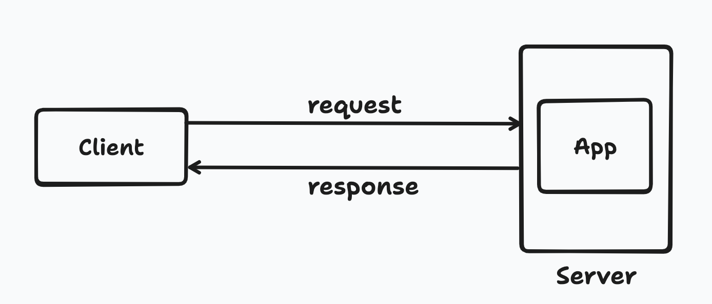

# Basic server working

Client would be requesting server. Server would be in a container and has application in it, along with it's dependencies. This model is called as `Request and Response model`.

When client makes a request to server, few actions would take place. First server would be identifying the message sender, where message sender should be authenticated to access the data. The second task is by the server responding in a response way to the request. This is how a basic server would be working.

 

## References

- [How server works and it's working](https://www.youtube.com/watch?v=V9K1l3OL-Iw)
