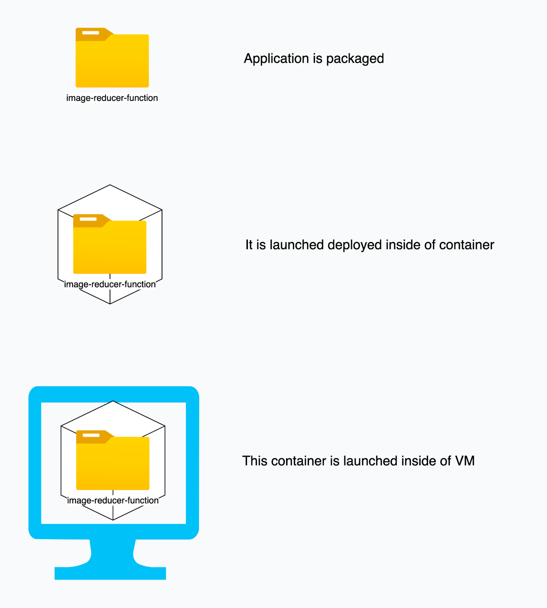

# Architecture of Serverless

Instead of allowing the developers to manange the architecture of serverless, cloud provider take up these responsibilities. This allows developer to focus on development.One of the popular example of serverless service is FaaS (Function as a Service). Here developer writes the code deploys it.

## What happens when serverless function is executed internally?

Whenever developer packages & host the application as FaaS, it is packaged & stored in memory. It can be any memory service which depends on cloud vencor you are opting for. In case of AWS it is S3 bucket & in case of azure it is storage account.

When deploying the developer sets the trigger.

There are following types of triggers.

1. HTTP Trigger
2. Queue Trigger
3. Event Hub Trigger
4. Blog trigger

Triggers available might vary based on cloud providers. It can be either of above. Mostly id depends on use case. You can have function executing which you want to act as controller for HTTP requests. It can be async task such as sending email on registration of new user.

Whenever request comes packaged application code is launched inside of container as process. Whenever request comes it is forwarded to this process. This conatiner is kept alive for while to server multiple requests if there are any.

As traffic to function increases the internally the more instances of container are launched. Traffic is then internally load balanced among these containers.

## Synchronus & Asychronus working of function

Serverless function can be set to execute synchronusly or asynchronusly. In case of http trigger function need to be executed synchronously. HTTP request gets completed when function sends the appropriate response back to user.

But in case of queue or event trigger it can executed in asynchornously. An example can be confirmation email sent to user after signup. Whenever user signups and you want to send the confirmation email to that user. You can have function set up which will look out for new user signup event. Whenever new user signs a serverless function is triggered which send the email.

## Where is azure function actually hosted?

Broad level answer is some data center of cloud vendor. While creating the serverless function you can set the region where your function will be hosted. All the files requried for the function to get hosted are stored in one of the storage service provided by the same cloud vendor.

## Architecture differences between server & serverless.

When application is hosted on server there are sevaral things that developer needs to manage. Devloper needs to set the up the following parameters when it comes to server.

1. Security: Developer needs to set up the secuirty measure .

2. Scalalibility: Developer needs to go manually scale up the server. It can be horizontal or vertical scaling.

3. Setup: In terms of setup, developer manually needs to setup the environment & deploy the application.

4. Accessiblity: Developer needs to setup the dns/public ip to access the resource.

### References

1. [What is serverless? By Redhat](<https://www.redhat.com/en/topics/cloud-native-apps/what-is-serverless#:~:text=Under%20a%20serverless%20model%2C%20a,a%2DService%20(FaaS).>)

2. [Serverless Architecture](https://www.datadoghq.com/knowledge-center/serverless-architecture/)

3. [Google Cloud function trigger](https://cloud.google.com/functions/docs/calling)

4. [Azure function trigger](https://www.serverless360.com/blog/azure-functions-triggers-and-bindings)

5. [Wokring of AWS lambda](https://www.youtube.com/watch?v=e8tLGC3ZadQ)

6. [Working of Azure functions](https://www.serverless360.com/blog/azure-functions-internals)

7. [Azure functions internals](https://www.serverless360.com/blog/azure-functions-internals)

8. [Example of serverless](https://blog.hubspot.com/website/serverless-functions)
